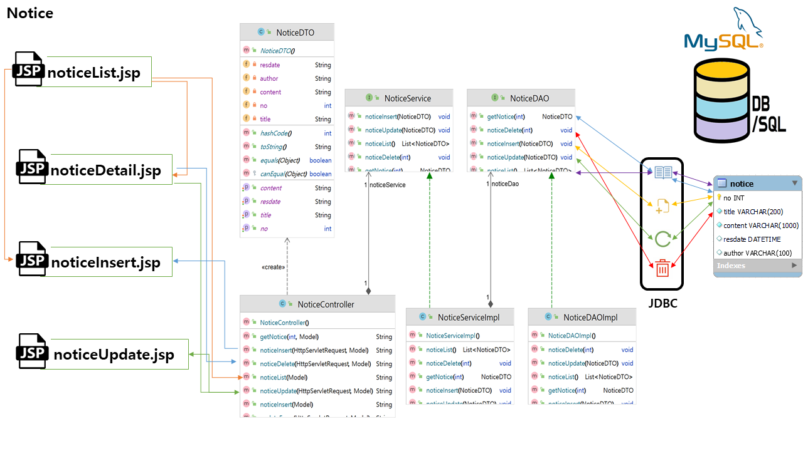
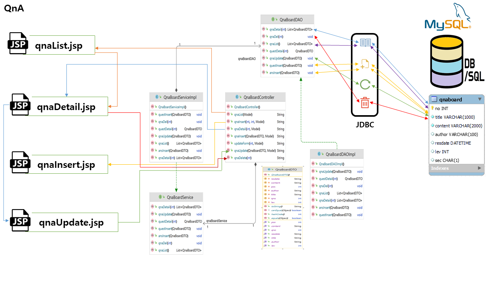
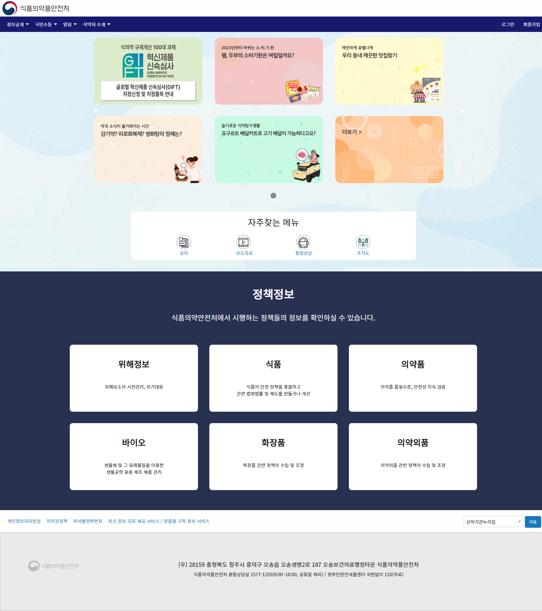

# SpringLegacy Project
Goverment(식품의약품안전처) + SpringLegacy + Maven MVC Project + MySql

### 📢 프로젝트 설명 
- 개인프로젝트 
  - 정부중앙부처 식품의약품안전처를 주제로 진행한 개인프로젝트  
  Spring Legacy > Maven MVC 
- 구현 목표 
  - Controller, Model(DAO), DTO, EL, JSTL 등을 활용한 데이터 바인딩으로
  공지사항 CRUD, QnA CRUD, ckEditor 기반 자유게시판 CRUD 구현
  - Ajax 기반 아이디 중복확인

### ⚙ 개발 환경
- 운영체제 : Windows-11
- 통합개발환경(IDE) : Intellij, STS
- JDK version : JDK 1.8
- 데이터베이스 : MySQL
- 빌드 툴 : Maven
- 관리 툴 : GitHub

### 💻 기술 스택
- 백엔드
  - Mybatis
- 프론트엔드 
  - HTML, CSS, Javascript, BootStrap 
- DB 
  - MySQL

### 🔌 Dependencies
- Spring Web
- Inject
- Servlet
- junit
- Lombok
- MySQL Connector
- Mybatis
- JSON
- Commons

### 🛠 DB 설계

### 📜 메뉴 구성

### 📟 시퀸스 로직

### 🎥 화면 구조(업데이트중)
- 메인화면

- 회원기능
  - 로그인
  
  - 회원가입(약관동의)
  
  - 회원가입(가입정보입력)
  
  - 마이페이지
  
  
- 메뉴3(알림)
  - 공지
  
  - 공지작성
  
  
- 메뉴4(식약처소개)
  - 비전/슬로건
  
  - 연혁
  
  - 조직도
  

### 🕹 구현 기능 (작성중)
- Controller, Model(DAO), DTO, EL, JSTL 등을 활용한 데이터 바인딩
  - 공지 사항 CRUD
  - QnA CRUD
  - 회원 CRUD
  - Ajax 아이디 중복확인